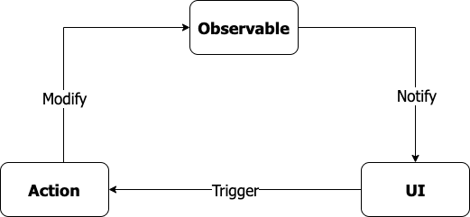

# Mobx - Gerenciamento de estados

MobX consiste em ser uma biblioteca de gerenciamento de estado que possui o objetivo de simplificar a comunicação dos dados reativos do seu projeto com a interface do usuário.




O Mobx possui 3 pilares, que são:
1. Actions
2. Observables
3. Reactions


Um exemplo para tentar explicar melhor:

Imagine que toda variável no seu código seja um Observable, ou seja, um objeto que quando for alterado seu valor, ele irá notificar a você.

Para sua variável que é um Observable ser alterada, você possui várias funções no seu código, e que cada função representa uma Action, ou seja, uma Action representa uma função que, dentro do seu escopo altera um ou mais Observables, que são suas variáveis.

Agora pense na interface do usuário, imagine que você esteja usando uma variável que o valor dela é mostrada ao usuário, e que no seu código você possui um método que toda vez que o usuário clicar em determinado botão, o valor dessa variável é atualizada ao usuário. Essa parte da variável que fica amostra para o usuário é chamada de Reaction.

Toda vez que uma Action alterar o valor de um Observable, as Reactions na interface de usuário que possuem o determinado Observable serão notificadas, atualizando assim o valor da variável, um exemplo de programação reativa.


#### Depedencias

```dart
dependencies:
    flutter:
        sdk: flutter
    mobx: 
    flutter_mobx: 
```

#### Depedencias de desevolvimento

```dart
dependencies:
    flutter:
        sdk: flutter

    build_runner:
    mobx_codegen:
```

#### Build runner comandos

gerando arquivos g.dart
```command
flutter packages pub run build_runner build
```

limpando arquivos
```command
flutter packages pub run build_runner clean
```

#### Estrututa básica de um controller 
```dart
import 'package:mobx/mobx.dart';
part 'counter.g.dart';

class Counter = _Counter with _$Counter;

abstract class _Counter with Store {
    @observable
    int value = 0;

    @action
    increment() {
        value++;
    }
}
```


#### Observables

Precisamos criar observaveis, para tornar um objeto observal pela nossas aplicação.

Chamamos este padrão de Publish/Subscriber, onde vários Widgets podem se inscrever para receber uma notificação a cada alteração de uma variável.

Utilizamos uma decorador <b>@observable</b>.

```dart
    @observable
    int value = 0;

    @observable
    String nome = 0;

    @observable
    bool isValid = 0;
```

#### Observable List

Precisamos criar observaveis, para tornar um objeto observal pela nossas aplicação.

Chamamos este padrão de Publish/Subscriber, onde vários Widgets podem se inscrever para receber uma notificação a cada alteração de uma variável.

Utilizamos uma decorador <b>@observable</b>.

```dart
    @observable
    ObservableList<int> values = ObservableList.of([]);
```

#### Actions

Precisamos criar acões, para alterar nossos observables.

Desta forma, tudo que precisamos fazer é decorar este método com @action, afinal as ações nada mais são do que métodos que contém nossas regras e alteram nossos observáveis (Estado).

Utilizamos uma decorador <b>@action</b>.

```dart
    @action
    void increment(){
        value = value + 1;
    };

    @action
    void add(int value) {
        values.add(value);
    }

```

# Componentes reativos

#### Observer

Precisamos adicionar este widget, onde for necessãrio escutar uma <b>mudança de estado</b> na <b>interface</b>, que precise ser mostrado ao usuário.

```dart
    Observer(
        builder: (_) => Text('${counter.value}'),
    ),
```

# Injeção com Provider

Para facilitar o acesso e compartilhamento na arvore do componentes no flutter, podemos utilizar o Provider.

##### Criando uma store

```dart
import 'package:mobx/mobx.dart';
part 'user_store.g.dart';

class UserStore = _UserStoreBase with _$UserStore;

abstract class _UserStoreBase with Store {
  @observable
  String nome = "";

  @action
  void setUser(String newNome) => nome = newNome;
}
```

Precisamos incluir no topo da arvore, o componente de provedor multiplo, incluido com o pacote Provider

```dart
void main() {
  runApp(MultiProvider(providers: [
    Provider<UserStore>(
      create: (_) => UserStore(),
    )
  ], child: MobxApp()));
}
```


Faz com que o componente escute mudançar ocorridas

```dart
    context.watch<T>()
    //exemplo
    context.watch<UserStore>().nome;
```

Retorna o T sem escutar
```dart
    context.read<T>()
    //exemplo
    final userStore = context.read<UserStore>();
```

Faz com que o componente escute somente uma parte de T
```dart
    context.select<T, R>(R cb(T value))
    //exemplo
```


Referências

https://balta.io/blog/flutter-mobx
https://medium.com/flutter-comunidade-br/flutter-com-mobx-c0f4762fbd1a
https://circleci.com/blog/state-management-for-flutter-apps-with-mobx/
https://itnext.io/flutter-state-management-with-mobx-and-providers-change-app-theme-dynamically-ba3b60619050
